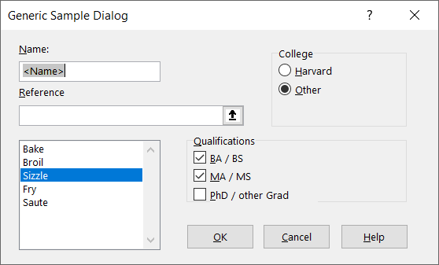
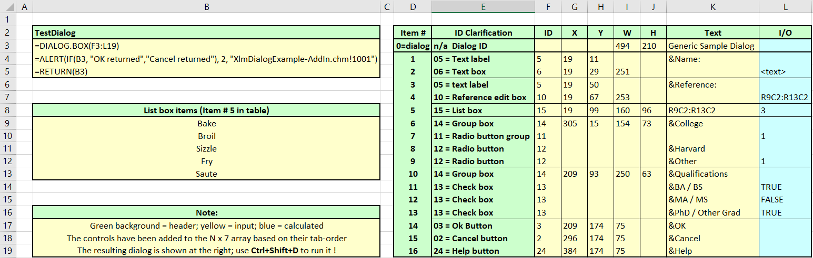
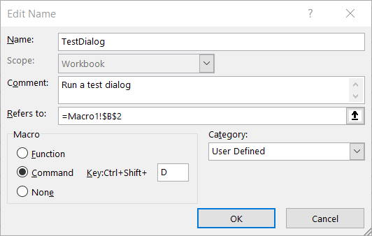
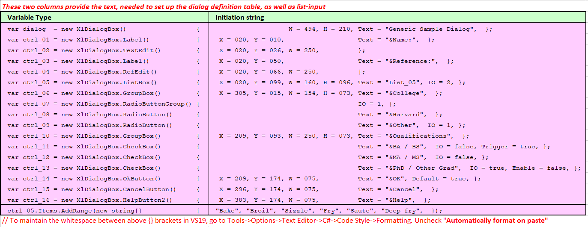
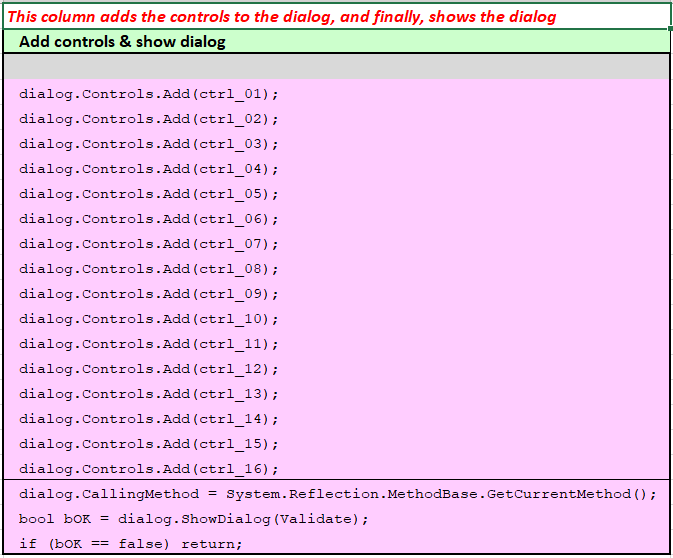

# ExcelDna-XlDialogBox
### C# wrapper for XLM macro DIALOG.BOX

*Note; this code builds further on the ExcelDna-XlDialog class, available [here](https://github.com/zwq00000/ExcelDna-XlDialog) on GitHub.*

The DIALOG.BOX macro is part of the XLM macro's that predate *Visual Basic for Applications* (VBA) and were introduced in Excel 4.0.  Documentation of these macro functions is hard to come by, but a comprehensive [function reference document](https://d13ot9o61jdzpp.cloudfront.net/files/Excel%204.0%20Macro%20Functions%20Reference.pdf) can be found on cloudfront.net.

You may wonder, why spend time and effort on working on such ancient technology, but the point is that there are no good RefEdit controls available (yet) for Winforms or WPF-forms.  This is discussed in-depth [here](https://www.breezetree.com/blog/excel-refedit-in-c-sharp/).

The XLM functions and commands are still available in Excel-365 and are exposed to developers  through the `2013 Office System Developer Resources` that provide support in writing  Excel 2013 XLL's'. The following function call creates a dialog box: 

```c
Excel12(xlfDialogBox, &returnValue, 1, &DialogDefinition)
```

Using this  functionality requires working with LPXLOPER12 structures that are complex to deal with, because of the  various overloads that exist, and the interaction with Excel's internal memory. A dialog box call, running in a verification loop could look like:

```C#
xloper ret_val;
int xl12;
cpp_xloper DialogDef((WORD) NUM_DIALOG_ROWS, (WORD) NUM_DIALOG_COLUMNS, UsernameDlg);
// now set up the N x 7 dialog definition array DialogDef
do
{
    xl12 = Excel12(xlfDialogBox, &ret_val, 1, &DialogDef);
    if (xl12 || (ret_val.xltype == xltypeBool && ret_val.val._bool == 0))
        break;
    // Process the input from the dialog by reading the 7th column of the returned array.
    // ... code omitted
    
    Excel2(xlFree, 0, 1, &ret_val);
    ret_val.xltype = xltypeNil;
}
while (1);
Excel12(xlFree, 0, 1, &ret_val);
return 1;
```

Developing Excel extensions is a daunting task, which is easy to understand, when you start reading through the [online documentation](https://docs.microsoft.com/en-us/office/client-developer/excel/developing-excel-xlls). Here is where `Excel-DNA` comes to the rescue. Thanks to [Excel-DNA,](https://excel-dna.net/) writing Excel extensions  has become much easier, the code base is easier to maintain and context sensitive help (_compiled into an *.chm file_) is now straightforward to implement. A call to set up a modal dialog box now becomes:

```C#
var result = XlCall.Excel(XlCall.xlfDialogBox, DialogDefinition);
```

Where :

* `XlCall.xlfDialogBox` is an enumerated value, telling Excel to create a dialog box. 

* `DialogDefinition` is a N x 7 two-dimensional array that defines the contents of the dialog box。

The `2013 Office System Developer Resources` provide a dialog example in the source file `GENERIC.C`.

In `GENERIC.C` the following Dialog Definition table is defined:

```c
static LPWSTR g_rgDialog[g_rgDialogRows][g_rgDialogCols] =
{
    {L"\000",   L"\000",    L"\000",    L"\003494", L"\003210", L"\025Generic Sample Dialog", L"\000"},
    {L"\0011",  L"\003330", L"\003174", L"\00288",  L"\000",    L"\002OK",                    L"\000"},
    {L"\0012",  L"\003225", L"\003174", L"\00288",  L"\000",    L"\006Cancel",                L"\000"},
    {L"\0015",  L"\00219",  L"\00211",  L"\000",    L"\000",    L"\006&Name:",                L"\000"},
    {L"\0016",  L"\00219",  L"\00229",  L"\003251", L"\000",    L"\000",                      L"\000"},
    {L"\00214", L"\003305", L"\00215",  L"\003154", L"\00273",  L"\010&College",              L"\000"},
    {L"\00211", L"\000",    L"\000",    L"\000",    L"\000",    L"\000",                      L"\0012"},
    {L"\00212", L"\000",    L"\000",    L"\000",    L"\000",    L"\010&Harvard",              L"\000"},
    {L"\00212", L"\000",    L"\000",    L"\000",    L"\000",    L"\006&Other",                L"\0011"},
    {L"\0015",  L"\00219",  L"\00250",  L"\000",    L"\000",    L"\013&Reference:",           L"\000"},
    {L"\00210", L"\00219",  L"\00267",  L"\003253", L"\000",    L"\000",                      L"\000"},
    {L"\00214", L"\003209", L"\00293",  L"\003250", L"\00263",  L"\017&Qualifications",       L"\000"},
    {L"\00213", L"\000",    L"\000",    L"\000",    L"\000",    L"\010&BA / BS",              L"\0011"},
    {L"\00213", L"\000",    L"\000",    L"\000",    L"\000",    L"\010&MA / MS",              L"\0011"},
    {L"\00213", L"\000",    L"\000",    L"\000",    L"\000",    L"\021&PhD / Other Grad",     L"\0010"},
    {L"\00215", L"\00219",  L"\00299",  L"\003160", L"\00296",  L"\015GENERIC_List1",         L"\0011"},
};
```

**Table 1.**

Where [LPWSTR](https://docs.microsoft.com/en-us/openspecs/windows_protocols/ms-dtyp/50e9ef83-d6fd-4e22-a34a-2c6b4e3c24f3) stands for a long (32-bit) pointer to a string containing wide (16-bit) Unicode characters. In the table above the strings are ***not*** null terminated; their length is defined upfront in octal format. E.g. in `L"\013&Reference:"`  we have 013 characters (base-8). This corresponds with  8+3 =  11 characters (base-10) followed by the 11 characters inside the string: `&Reference:`.  For readability it is easier to strip-off all the L"..." annotation.

This gives the following table:

```c#
    { null, null, null,  494,  210, "Generic Sample Dialog", 0},	// 00 = Dialog ID
    {   01,  330,  174,  088, null, "OK",                    0},	// 01 = Default Ok Button
    {   02,  225,  174,  088, null, "Cancel",                0},	// 02 = Cancel button
    {   05,  019,  011, null, null, "&Name:",                0},	// 05 = Text label
    {   06,  019,  029,  251, null,  null,                   0},	// 06 = Text box
    {   14,  305,  015,  154,  073, "&College",              0},	// 14 = Group box
    {   11, null, null, null, null,  null,                   2},	// 11 = Radio button group
    {   12, null, null, null, null, "&Harvard",              0},	// 12 = Radio button
    {   12, null, null, null, null, "&Other",                1},	// 12 = Radio button
    {   05,  019,  050, null, null, "&Reference:",           0},	// 05 = text label
    {   10,  019,  067,  253, null,  null,                   0},	// 10 = Reference edit box
    {   14,  209,  093,  250,  063, "&Qualifications",       0},	// 14 = Group box
    {   13, null, null, null, null, "&BA / BS",              1},	// 13 = Check box
    {   13, null, null, null, null, "&MA / MS",              1},	// 13 = Check box
    {   13, null, null, null, null, "&PhD / Other Grad",     0},	// 13 = Check box
    {   15,  019,  099,  160,  096, "GENERIC_List1",         1},	// 15 = List box

```

**Table 2.**

The above table is used to define the dialog control items that make up the XlDialogBox dialog. Therefore the following figure closely resembles the dialog example from `GENERIC.C` from the  `2013 Office System Developer Resources`, be it that a help button has been added. 

 

**Figure 1. Example dialog**

The C# code to create the above dialog box is shown below:

```c#

[ExcelCommand(
    Name = "Dialog1",
    Description = "Starts an example Dialog",
    HelpTopic = "XlmDialogExample-AddIn.chm!1001",
    ShortCut = "^R")]
public static void Dialog1Command()
{
    var dialog = new XlDialogBox()                      { W = 494, H = 210, Text = "Generic Sample Dialog" };

    var okBtn = new XlDialogBox.OkButton()              { X = 209, Y = 174, W = 075, H = 023 };
    var cancelBtn = new XlDialogBox.CancelButton()      { X = 296, Y = 174, W = 075, H = 023 };
    var helpBtn = new XlDialogBox.HelpButton2()         { X = 384, Y = 174, W = 075, H = 023 };

    var nameLabel = new XlDialogBox.Label               { X = 019, Y = 011, Text = "&Name:" };
    var nameEdit = new XlDialogBox.TextEdit             { X = 019, Y = 029, IO_string = "<Name>" };

    var refLabel = new XlDialogBox.Label                { X = 019, Y = 050, Text = "&Reference" };
    var refEdit = new XlDialogBox.RefEdit               { X = 019, Y = 067, W = 253 };

    var listEdit = new XlDialogBox.ListBox()            { X = 019, Y = 099, W = 160, H = 96, IO_index = 2, Text = "GEN_List1" };
    listEdit.Items.AddRange(new string[]                { "Bake", "Broil", "Sizzle", "Fry", "Saute" });

    var CollegeBox = new XlDialogBox.GroupBox           { X = 305, Y = 015, W = 154, H = 073, Text = "College" };
    var RadioGroup = new XlDialogBox.RadioButtonGroup   { IO_index = 1, Enable = false };
    var RadioHarvr = new XlDialogBox.RadioButton        { Text = "&Harvard", Enable = false };
    var RadioOther = new XlDialogBox.RadioButton        { Text = "&Other", Enable = false };

    var qualiGroup = new XlDialogBox.GroupBox           { X = 209, Y = 093, W = 250, H = 063, Text = "&Qualifications" };
    var BaBsCheck = new XlDialogBox.CheckBox            { Text = "&BA / BS", IO_checked = true };
    var MaMsCheck = new XlDialogBox.CheckBox            { Text = "&MA / MS", IO_checked = true };

    // note: setting Trigger = true for PhD_Check (or any other triggerable control) will initiate a 'validate' callback
    var PhD_Check = new XlDialogBox.CheckBox            { Text = "&PhD / other Grad", Trigger = true };

    // The sequence of adding controls is important in view of the tab order.
    // Note: always put the 'labels' *in front* of their (edit/list) controls.

    dialog.Controls.Add(nameLabel);
    dialog.Controls.Add(nameEdit);

    dialog.Controls.Add(refLabel);
    dialog.Controls.Add(refEdit);

    dialog.Controls.Add(listEdit);

    dialog.Controls.Add(CollegeBox);
    dialog.Controls.Add(RadioGroup);
    dialog.Controls.Add(RadioHarvr);
    dialog.Controls.Add(RadioOther);

    dialog.Controls.Add(qualiGroup);
    dialog.Controls.Add(BaBsCheck);
    dialog.Controls.Add(MaMsCheck);
    dialog.Controls.Add(PhD_Check);

    dialog.Controls.Add(okBtn);
    dialog.Controls.Add(cancelBtn);
    dialog.Controls.Add(helpBtn);

    // Use reflection to define the method that is calling the dialog box, 
    // so we can select the correct HelpTopic from the ExcelCommand attribute 
    dialog.CallingMethod = System.Reflection.MethodBase.GetCurrentMethod(); 

    bool bOK = dialog.ShowDialog(validate);
    if (bOK == false) return;

    // now it is time to play around with the parameters chosen in the dialog box to get things done
    var xlApp = (Application)ExcelDnaUtil.Application;
    var ws = xlApp.Sheets[1] as Worksheet;
    var range = ws.Cells[1, 1] as Range;
    range.Value2 = nameEdit.IO_string;
}
```

------

### Some guidance 

The dialog box definition table must be at least two rows high, and shall be seven columns wide.  The definition of the dialog itself is in the first row of the table. This row also specifies the default selected item and may contain the reference for the Help button in the Item number column.  

The definitions of each column in a dialog definition table are listed in the following table.

| Column type            | Column (1-referenced) | Index (0-referenced) |
| ---------------------- | :-------------------: | :------------------: |
| Item number            |           1           |          0           |
| Horizontal position    |           2           |          1           |
| Vertical position      |           3           |          2           |
| Item width             |           4           |          3           |
| Item height            |           5           |          4           |
| Item text              |           6           |          5           |
| Initial value / result |           7           |          6           |

#### Item number

The first column in each row of the dialog definition table contains the item number. It is an enumeration with one out of 24 values shown in the following table that defines the type of dialog control item being displayed. See the table below for different dialog control types.

#### Horizontal, vertical position, width and height

These are integer numbers. They can be left undefined when items are part of a group box. To position an item at least horizontal and vertical position need to be defined. In that case the control gets a default size

#### Item text

Describes the static text shown by an item. 

#### Initial value / result

The last column in each row is used for data exchange. Whereas the data types of column 1 - 6 are given (string or int), column 7 can contain a number or a string.  To work with this column an IO object has been defined in the  `ControlItem` class.

***

#### XlControl enumeration table

| Dialog-box item                                              | Item number |
| ------------------------------------------------------------ | :---------: |
| Default OK button                                            |           1 |
| Cancel button                                                |           2 |
| OK button                                                    |           3 |
| Default Cancel button                                        |           4 |
| Static text                                                  |           5 |
| Text edit box                                                |           6 |
| Integer edit box                                             |           7 |
| Number edit box                                              |           8 |
| Formula edit box                                             |           9 |
| Reference edit box                                           |          10 |
| Option button group                                          |          11 |
| Option button                                                |          12 |
| Check box                                                    |          13 |
| Group box                                                    |          14 |
| List box                                                     |          15 |
| Linked list box                                              |          16 |
| Icons                                                        |          17 |
| Linked file list box     (Microsoft Excel for Windows only)  |          18 |
| Linked drive and directory box     (Microsoft Excel for Windows only) |          19 |
| Directory text box                                           |          20 |
| Drop-down list box                                           |          21 |
| Drop-down combination edit/list box                          |          22 |
| Picture button                                               |          23 |
| Help button                                                  |          24 |

#### Remarks

A number of controls (*Integer edit box, Number edit box, Formula edit box and Reference edit box*) do internal data validation and may therefore prevent the OK button from exiting the dialog (for instance when you enter `1.5` in an Integer edit box (no. 8 on the enumeration table).

------

### Dialog items

Most of the dialog items are simple and no further explanation is required. For some a little more explanation is helpful.

#### Help (!!), Next, Back and Apply buttons

I have **not** been able to make the `Help` button work. As a workaround a `help2` button has been derived from an OK button with `Initial value = -1`.
Likewise, `Next`, `Back` and `Apply` buttons have been defined to help creating Wizard functionality.

#### Text and edit boxes

Vertical alignment of a text label to the text that appears in an edit box is important aesthetically. For edit boxes with the default height (set by leaving the height field blank) This is achieved by setting the vertical position of the text to be that of the edit box + 3.

#### Buttons

Selecting a cancel button (item 2 or 4) causes the dialog to terminate returning FALSE.  Pressing any other button causes the function to return the offset of that button in the definition table in the 7th column, 1st row of the returned array that describes the dialog itself.

#### Radio buttons

A group of radio buttons (12) must be preceded immediately by a radio group item (11) and must be uninterrupted by other item types. 
If the radio group item has no text label, the group is not contained within a border. 
If the height and/or width of the radio group are omitted but text is provided, a border is drawn that surrounds the radio buttons and their labels.

#### List-boxes

The text supplied in a list box item row should either be a name (DLL-internal or on a worksheet) that resolves to a literal array or range of cells. 
It can also be a string that looks like a literal array, e. g. "{1, 2, 3, 4, 5, \"A\", \"B\", \"C\"}" (where coded in a C source file). 
List-boxes return the position (counting from 1) of the selected item in the list in the 7th column of the list-box item line. 
Drop-down list-boxes (21) behave exactly as list boxes (15) except that the list is only displayed when the item is selected.

#### Linked list-boxes

Linked list-boxes (16), linked file-boxes (18) and drop-down combo-boxes (22) should be preceded immediately by an edit box that can support the data types in the list.  The lists themselves are drawn from the text field of the definition row which should be a range name or a string that represents a static array.  A linked path box (19) must be preceded immediately by a linked file-box (18).
Drop down combo-boxes return the value selected in the 7th column of the associated edit box and the position (counting from 1) of the selected item
in the list in the 7th column of the combo-box item line.

------

### Special conditions

Special dialog item conditions refer to 'triggers', 'enabling/disabling' as well as making dialog items 'visible/invisible' by increasing the Item number by 50 / 100 / 200, as described in the three paragraphs below.

#### Triggers

Adding 100 to certain item numbers causes the function to return control to the XLL when the item is clicked on, with the dialog still displayed. 
This "trigger feature" enables the `xlfDialogBox` command to alter the dialog, validate input and so on, and return for more user interaction. 
The position of the item number chosen in this way is returned in the 1st row, 7th column of the returned array. 

This feature does not work with static text (item 5) edit boxes (6, 7, 8, 9 and 10), group boxes (14), pictures (23) or the help button (24). 
Those controls just ignore the trigger request if 100 would be added to their item numbers.

In the get/set code for the dialog control items this is accomplished by setting `Trigger = true / false`. 

#### Disabling

Adding 200 to any item number, disables (greys-out) the item. A disabled item cannot be chosen or selected. For example, 203 is a disabled OK button. 
You could for instance use item 223 to include a picture in your dialog box that does not behave like a button.

In the get/set code for the dialog control items this is accomplished by setting `Enable = true / false`. 

#### (In-) visible

Unlike `trigger`and `disable` The `Visible` property  is **not officially part of** the documented properties of the dialog controls, but has been accomplished by a bit of a hack. Normally, there won't be much need to **hide** dialog items that have been defined in the `DialogDefinition` table; if needed, invalid controls can always be disabled. However, it is possible to hide dialog items by giving them an Item number > 24.  When this happens, a dialog item is not recognized and it is skipped from the tab-order. To implement this,  50 is added to any dialog item that needs to be 'hidden'.

In the get/set code for the dialog control items this is accomplished by setting `Visible = true / false`. 

*Note: in the original implementation, `visible` was a property outside of the 7-parameter dialog item properties. This led to complexities in managing the the N x 7 dialog table, as the invisible items do not show up in this table. This makes data validation rather complex, as both tables are (potentially) not in sync.*

#### Validate()

An example of a skeleton Validate() function is shown below.

```c#
static bool validate(int index, object[,] dialogResult, XlDialogBox.XlDialogControlCollection Controls)
{
    // index is 0-based index of control that caused a trigger,leading us into this Validate() routine
    int i = index;	// just some code to set a breakpoint at this line
    
    // ...
    // check user input
    // code omitted
    // ...

    return true; 	// return to dialog; more work to be done with the dialog

    // ...
    // check user input
    // code omitted
    // ...
    
    return false;	// don't return to dialog; start evaluating user input and return to excel
}
```

When the `trigger` functionality isn't used, then `Validate()` won't be called and it can be set at null, or can be omitted altogether in the call to `ShowDialog`  :

```c#
bool bOK = dialog.ShowDialog(null);
// or:
bool bOK = dialog.ShowDialog();
```

------

### Building the code

Finally, to successfully build the code, you need to copy the following source files to your solution:

* `XlDialogBox.cs` - source file containing all dialog classes
* `XlDialogBoxExtensions.cs` - extension on `obj` used in `XlDialogBox.cs`

And you need to have the following NuGet packages installed :

* `ExcelDna.AddIn` by Govert van Drimmelen
* `ExcelDna.Integration` by Govert van Drimmelen

* `ExcelDnaDoc` by David Carlson (*essential for context sensitive help*)

For questions or suggestions please use the [Excel-DNA](https://groups.google.com/g/exceldna) user group on Google.com.

------

### Testing the Dialog Layout

Building a dialog based on X, Y, W, H parameters is all but a WYSIWYG process. It is more a trial and error approach.  There are several ways to make this easier, e.g. by first creating 'reference' dialogs using VBA or using WinForms, and copying their layout. Alternatively, one can (still) use Excel's built-in 4.0 Macro functionality, using the following steps:

1. Open a new Excel workbook.

2. Insert an XLM macro sheet by right-clicking on one of the worksheet tabs and selecting `Insert... -> MS Excel 4.0 Macro`.

3. In the **macro sheet**, build the `DIALOG.BOX` functionality, by following these steps:

   * in cell B2 place a label , say, **TestDialog**, and use this label later as a name for the macro that starts at cell B3.
   * In cell B3 place the formula `=DIALOG.BOX(DIALOG_DEFN)` – (the range `DIALOG_DEFN` is created in a later step).
   * In cell B4 write  `=ALERT(IF(B3, "OK returned","Cancel returned"), 2, "XlmDialogExample-AddIn.chm!1001")` to check return values
     Or simply write `=ALERT(IF(B3, "OK returned", "Cancel returned"))` to do away with the `Help` button.
   * In cell B5 write `=RETURN(B3)` to return the value from `DIALOG.BOX()`. 

4. Now we are done setting up the skeleton of the DIALOG.BOX() macro function. It's time to dress it up. First it needs a `DIALOG_DEFN'`. This can be done in either of two ways:

   1. By using a *named range* (`DIALOG_DEFN` as shown above)
   2. By using a *range-reference* (As used in the code example)

   In the example in **Figure 2** below, the range of N x 7 input parameters has been defined in cells `F3:L19` and has been passed to the dialog as a range-reference:  `DIALOG.BOX(F3:L19)`.

5. For controls that are **list boxes** (type 15, or similar; see text above under List-boxes) the list of values to chose from needs to be defined separately. Again, this can be done in one of two ways:

   1. By using a *named range*
   2. By using a *range-reference*

6. In the example below, the **list** of 5 items has been defined in cells `B9:B13` and has been passed to the **list control item** as a range-reference:  `R9C2:R13C2`. Please note that for one reason or another, the **list control item** only accepts ranges defined in the *row-column* (R1C1) format.

7. To make the **TestDialog** macro more accessible, please take the following steps from the Formulas Ribbon:

   * Select Cell B2, containing the **TestDialog** label.
   * Select `Define Name` from the `Defined Names` group in the `Formulas` ribbon.
   * This will bring up the `New Name` dialog, where you should define `TestDialog` as a Command, and for easy of access, add a Shortcut key. This is clarified in **Figure 3** below. 

   

 

**Figure 2. The dialog from Figure 1, now defined in a Excel 4.0 Macro sheet**


The Name dialog (from the Formulas ribbon) can be used to make the macro accessible using the `Ctrl+shift+D` key combination, as shown in **Figure 3**:

 

**Figure 3. Excel's Name dialog**


Lastly, to help transferring the dialog layout into your C# code, two tables have been added to the spreadsheet.

* The first table defines the controls and their layout, as well as that of one or more lists (if needed)
* The second table add the controls to the dialog, and then shows the dialog


 

**Figure 4. A table that defines 16 controls and their layout, and the content of a list**


 

**Figure 5. 16 controls added to the dialog, and the dialog called**


------

### Get going...

Finally, it is now time to play around with the dialog layout, before hardwiring this in your C# code. Overall it is still a laborious process compared to using graphical design tools, like those in Visual Studio for user forms, but making some changes and testing them is now fairly quick and easy 😊.

An example spreadsheet [DialogBox.xlsb](DialogBox.xlsb) has been included in the project to assist. This [link](https://exceloffthegrid.com/using-excel-4-macro-functions/) provides more information on the use of Excel 4.0 macro's. Here's some information on [programming with the C API](https://github.com/MicrosoftDocs/office-developer-client-docs/blob/master/docs/excel/programming-with-the-c-api-in-excel.md) in Excel, also covering the relation to XLM, the 'old' [XLM macro language](https://github.com/MicrosoftDocs/office-developer-client-docs/blob/master/docs/excel/programming-with-the-c-api-in-excel.md#c-api-and-its-relation-to-xlm).
